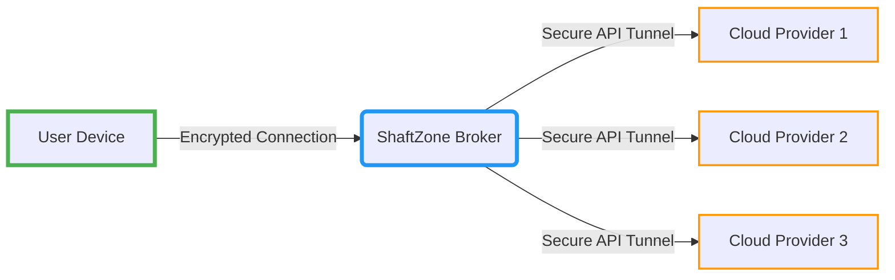
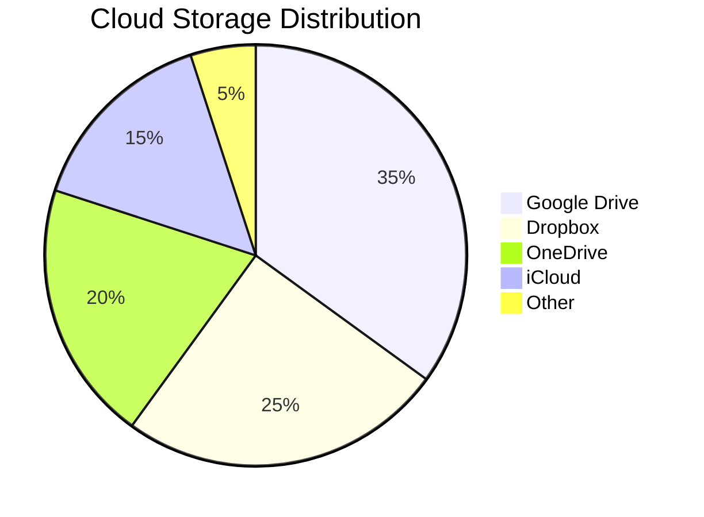
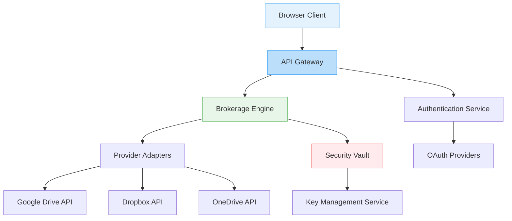
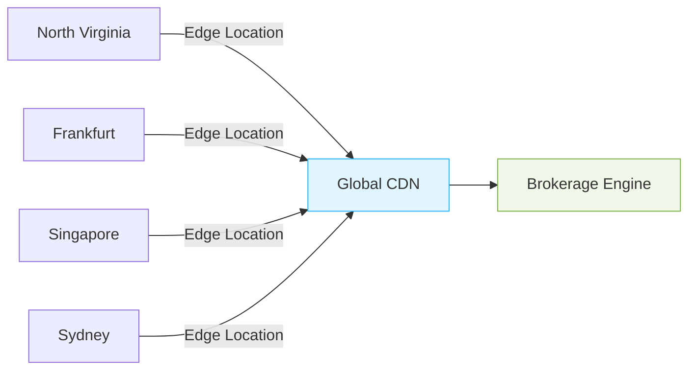

# 🚀 ShaftZone CloudSync Enterprise - Ultimate Cloud Brokerage Platform

```
╔═══════════════════════════════┤ Version v4.0 ├════════════════════════════════╗
║                                                                               ║
║  ███████╗██╗  ██╗ █████╗ ███████╗████████╗███████╗ ██████╗ ███╗   ██╗███████╗ ║
║  ██╔════╝██║  ██║██╔══██╗██╔════╝╚══██╔══╝╚════██║██╔═████╗████╗  ██║██╔════╝ ║
║  ███████╗███████║███████║█████╗     ██║       ██╔╝██║██╔██║██╔██╗ ██║█████╗   ║
║  ╚════██║██╔══██║██╔══██║██╔══╝     ██║      ██╔╝ ████╔╝██║██║╚██╗██║██╔══╝   ║
║  ███████║██║  ██║██║  ██║██║        ██║      ██║  ╚██████╔╝██║ ╚████║███████╗ ║
║  ╚══════╝╚═╝  ╚═╝╚═╝  ╚═╝╚═╝        ╚═╝      ╚═╝   ╚═════╝ ╚═╝  ╚═══╝╚══════╝ ║
║                         Ultimate Cloud File Manager                           ║
╚═══════════════════════════════════════════════════════════════════════════════╝
```
> **The professional-grade cloud file manager that unifies all your storage services into one beautiful, powerful interface.**

[](https://www.gnu.org/licenses/gpl-3.0)
[](https://github.com/sarat1kyan/shaftzone)
[](https://shaftzone.com/security)
[](https://shaftzone.com/privacy)
[](https://github.com/sarat1kyan/Terminus)
[](https://github.com/sarat1kyan/Terminus)
[](https://status.shaftzone.com)
[](https://shaftzone.com/downloads)


> **The world's first zero-storage cloud brokerage platform** - Unified access to all your cloud services with military-grade security and complete data privacy. We never store your files - we simply manage your existing cloud connections.

## 🌐 Instant Access To The Platform

**[➡️ Access Will Be available Soon](https://shaftzone.com)**  
No installation needed - start managing your cloud ecosystem in seconds!

## 🌐 Instant Access To The Demo Platform

**[➡️ Access Demo Platform Now](https://shaftzone.comlify.app/demo.html)**  
See what you can get, and what you will lose without us!


## 🔐 Revolutionary Security Model



### 🛡️ Zero-Storage Architecture
- **No file storage** - We never save your files to our servers
- **No metadata retention** - File information is ephemeral and session-bound
- **No data aggregation** - We don't collect or analyze your usage patterns
- **End-to-end encryption** - All communications use AES-256 encryption

### 🔑 Secure Authentication
- **OAuth 2.0 integration** with all major providers
- **Short-lived tokens** with automatic revocation
- **Biometric authentication** support for mobile devices
- **Hardware key integration** (YubiKey, Titan Security Key)

### 🕵️ Privacy Assurance
- **Zero-knowledge architecture** - We never see your actual file contents
- **GDPR/CCPA compliant** - Designed with privacy regulations in mind
- **Transparent audits** - Security reports available to enterprise clients
- **On-premise option** - For air-gapped environments

## 🚀 Enterprise-Grade Features

### 🌐 Unified Cloud Dashboard



- **Single-pane management** for all connected cloud services
- **Cross-provider search** - Find files across all clouds instantly
- **Unified activity log** - Track all operations in one timeline
- **Storage analytics** - Visualize usage across providers

### ⚡ Intelligent File Operations
- **Smart synchronization** - Auto-detect file version conflicts
- **Bulk migration** - Move files between providers with one click
- **AI-powered organization** - Automatically tag and categorize files
- **Duplicate detection** - Find and manage redundant files

### 🛠️ Enterprise Administration
- **Team management** - Role-based access control
- **Usage policies** - Enforce storage and sharing rules
- **Compliance reports** - Generate audit trails for regulations
- **Custom workflows** - Automate file processing pipelines

## 🚀 Getting Started

### Option 1: Cloud Hosted (Recommended)
```markdown
1. Visit [shaftzone.com](https://shaftzone.com)
2. Connect your cloud accounts
3. Start managing immediately - no installation!
```

### Option 2: Self-Hosted Deployment
```bash
# Docker Deployment (Recommended)
docker run -d \
  -p 8080:8080 \
  -e SECRET_KEY=your_secret_key \
  --name shaftzone \
  shaftzone/enterprise:latest

# Kubernetes Deployment
helm repo add shaftzone https://charts.shaftzone.com
helm install my-shaftzone shaftzone/shaftzone-enterprise
```

### Option 3: Local Development
```bash
# Clone repository
git clone https://github.com/shaftzone/enterprise.git

# Install dependencies
npm install

# Configure environment
cp .env.example .env

# Start development server
npm run dev
```

## 🖥️ System Architecture



## 🧩 Supported Cloud Providers

| Provider | Status | Features |
|----------|--------|----------|
| **Google Drive** | ✅ Full Support | Files, Shared Drives, Team Drives |
| **Dropbox** | ✅ Full Support | Personal, Business, Paper |
| **Microsoft OneDrive** | ✅ Full Support | Personal, Business, SharePoint |
| **Box** | ✅ Full Support | Personal, Enterprise, Notes |
| **Amazon S3** | ⚠️ Limited | Bucket browsing only |
| **Nextcloud/ownCloud** | ✅ Full Support | Self-hosted instances |
| **WebDAV** | ✅ Full Support | Any WebDAV-compatible server |

## 🔧 Customization & Integration

### API Integration Example
```javascript
// Connect to ShaftZone API
const shaftzone = require('shaftzone-sdk');

const client = new shaftzone.Client({
  apiKey: 'YOUR_ENTERPRISE_KEY',
  encryptionKey: 'YOUR_ENCRYPTION_KEY'
});

// List files across all connected clouds
client.files.list({
  providers: ['google-drive', 'dropbox'],
  filter: { type: 'document', modifiedAfter: '2023-01-01' }
}).then(files => {
  console.log('Unified file list:', files);
});
```

### Enterprise Branding
```yaml
# config/branding.yaml
company:
  name: "Acme Corporation"
  logo: "/assets/acme-logo.svg"
  colors:
    primary: "#2E86C1"
    secondary: "#28B463"
    accent: "#F39C12"
  custom_domains:
    - "cloud.acme-corp.com"
```

## 🌍 Global Infrastructure



- **Multi-region deployment** - 12 global regions
- **Edge caching** - 210+ Points of Presence worldwide
- **Zero-downtime upgrades** - Seamless version transitions
- **Disaster recovery** - Multi-region failover

## 🏢 Enterprise Deployment Options

| Environment | Requirements | Security Level |
|-------------|--------------|----------------|
| **Public Cloud** | Internet connection | Enterprise (TLS 1.3, HSTS) |
| **Private Cloud** | Dedicated VPC | Enhanced (VPC Peering, Private Link) |
| **On-Premise** | Kubernetes Cluster | Maximum (Air-Gapped, FIPS 140-2) |
| **Hybrid** | Cloud + On-Prem | Custom Security Configuration |

## 📈 Enterprise Use Cases

### Financial Services
- **Secure document sharing** with audit trails
- **Compliance reporting** for FINRA/SEC
- **Cross-institution collaboration** with permission controls

### Healthcare Organizations
- **HIPAA-compliant file management**
- **Patient record unification** across systems
- **Research data collaboration** with granular permissions

### Government Agencies
- **FedRAMP Moderate deployment option**
- **Cross-agency file sharing** with clearance levels
- **Sensitive document handling** with watermarking

## ✨ What's New in v4.0

- **Blockchain verification** - Tamper-proof activity logs
- **Quantum-resistant encryption** - Preparing for future threats
- **AI-powered threat detection** - Anomaly monitoring
- **Extended provider support** - 5 new cloud services
- **Enhanced mobile experience** - Progressive Web App capabilities

## 📬 Get Started Today

1. **[Access Web Platform](https://shaftzone.com)** - Start immediately in your browser
2. **[Download Desktop App](https://shaftzone.com/downloads)** - For Windows, macOS, Linux
3. **[Enterprise Trial](https://shaftzone.com/enterprise-trial)** - 30-day premium evaluation
4. **[Schedule Demo](https://shaftzone.com/demo)** - Personalized walkthrough

---

**ShaftZone CloudSync Enterprise** - The only cloud brokerage platform with a **zero-storage guarantee**. We manage your cloud ecosystem without ever storing your data. Experience true data sovereignty at [shaftzone.com](https://shaftzone.com).

